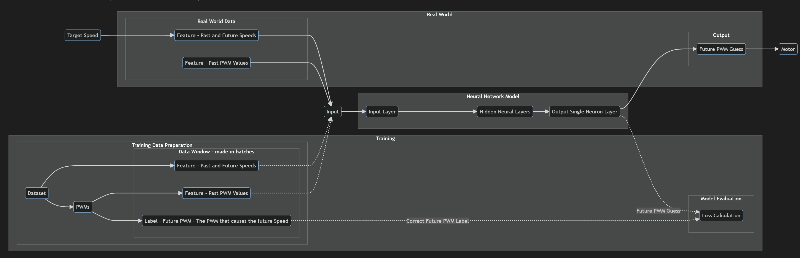
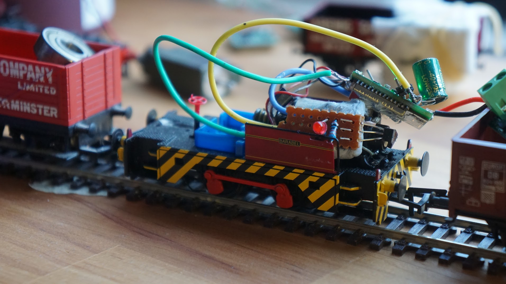
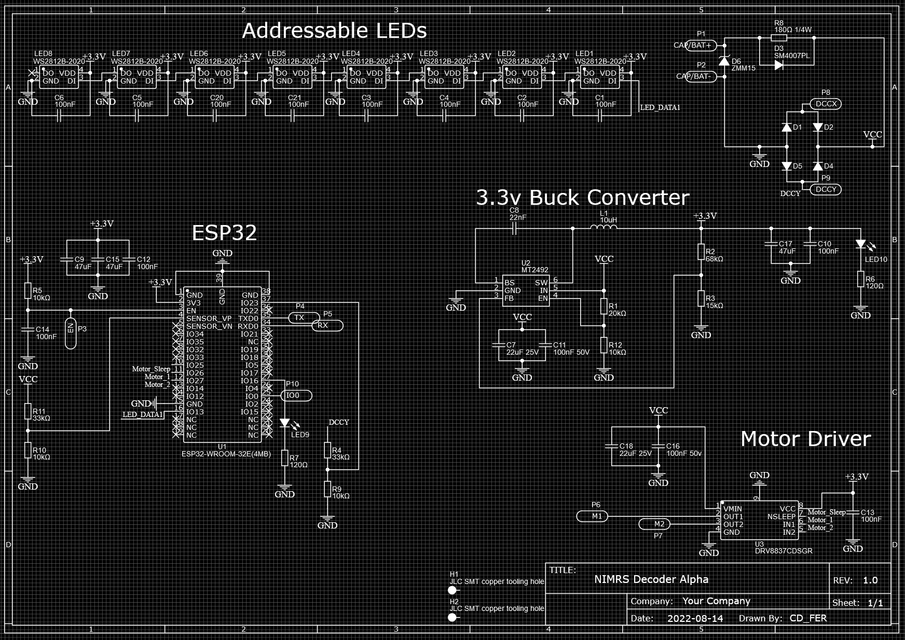

**Neural Network PID Replacement for Brushed DC Motors**
=============================================================

**Introduction**
---------------
This repository presents a novel approach to controlling brushed DC motors using neural networks, overcoming many of the limitations of traditional PID controllers. The motivation behind this project stems from the challenges of driving model trains smoothly, particularly at slow speeds. The low-quality motors often used in model trains, combined with the high static friction and backlash of worm drives, make it difficult to achieve stable and smooth motion. Additionally, the varying loads and inclines encountered by model trains further complicate the control problem. After struggling to achieve anything near good enough results with hand-tuned PID loops, I embarked on this project, which explores the potential of neural networks to learn and adapt to the complexities of model train control.

**View The Code**
---------------

**Microcontroller Code**:
* **C++ Code**: Located in `src/main.cpp` and `include/model`

**Model Training**:
* **Python Notebook**: `/modelTraining.ipynb` contains the model training code

**Conversion to C++ Header Files**:
* **Python Notebook**: `/convertToMicro.ipynb` contains the conversion code

**My Approach to Creating the Model**
------------------------------------

To train the neural network, I employed a unique approach:

* **Event-driven Timing**: Instead of running the model at fixed intervals, I opted to trigger the neural network when a rotation is complete, as indicated by the hall effect sensor.
* **Swarm-optimized Model Structure**: Instead of guessing, I set up a swarm of particles to find the number of history steps and parameters that give the best results.
* **Overview Chart**: The following diagram illustrates the overall flow of the neural network (more detail is in `/modelTraining.ipynb`): 
* **On-Device Training (not yet stable)**: The model can be trained (albeit much more slowly) on the ESP32 (see my on-device training demo library). I hope to have this stable in a week or so, once my brain recovers from the adventure of setting up this code -> I really have come to dislike corporate open-source code and the current state of TensorFlow...

**The Physical Setup**
---------------------

To overcome the challenges of controlling model trains, I designed a custom setup to collect data and train the neural network. The key components of this setup are:

* **Rotational Position Sensor**: Instead of using a traditional rotational position sensor, I opted for a digital hall effect sensor with one pulse per motor revolution. This was due to the difficulty of fitting a traditional sensor to the back of the motor. A small magnet is attached to the motor shaft to trigger the hall effect sensor.
* **ESP32-based Control Board**: I utilized a custom-designed ESP32-based control board, which I had manufactured by JLCPCB, to test digital model train control (DCC). A future version of the board is in development, which will offer significant improvements.

* **Power Supply**: The motor is powered by a small lithium-ion battery, which is boosted to 12V using a ME2149-based boost converter. I really like the ME2149; it really is an impressive boost IC that seems to have come out of nowhere.

**Dataset Generation**
---------------------

Generating the dataset for training the neural network was simplified using an ESP32 microcontroller, which can connect over WiFi. This allowed me to quickly:

* **Software Updates**: Flash software updates over LAN using ArduinoOTA
* **Real-time Data Collection**: Collect data in real-time using telnet over LAN and PuTTY to log the telnet data directly to the training data CSV files.

**Why Not RNNs or Reinforcement Learning?**
------------------------------------------

In exploring alternative approaches, I considered using **Recurrent Neural Networks (RNNs)** to model the temporal relationships in the motor's behavior. However, I opted against RNNs due to the challenges associated with training them, particularly the need for careful warm-up periods to stabilize the gradients.

I also experimented with **Reinforcement Learning (RL)**, but found it to be overly reliant on meticulous parameter and reward function tuning to achieve decent results. The trial-and-error process of adjusting rewards, penalties, and exploration rates proved time-consuming and frustrating, leading me to seek a more simple approach.

Instead, I chose to focus on a more traditional **feedforward neural network**, KISS.
